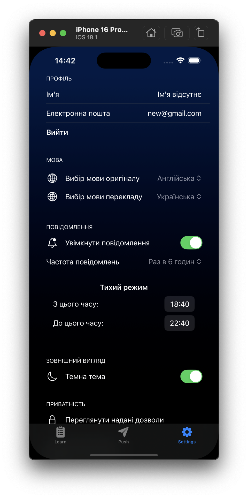
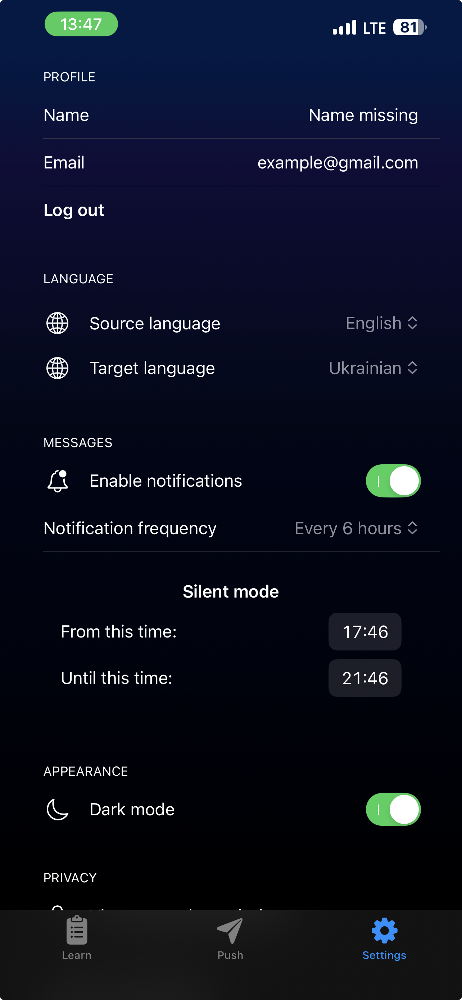

# PushLearn App

## Overview

This is a learning-focused iOS project designed to demonstrate modern iOS development practices, with a strong focus on architecture, work with an API, state management, concurrency, and dependency injection.

The project prioritizes engineering decisions and code structure over UI polish or feature completeness.

---

## Demonstration

---

## 📌 Tech Stack

### Firebase

- FirebaseAuth — user authentication.
- FirebaseFirestore — storing users with their data.

### Swift & IOS

- SwiftUI (iOS 17+)
- Observation framework (@Observable macro)
- Modern Concurrency (async / await, structured / unstructured concurrency)

### Architecture

- Feature-based MVVM
- Data Layer with Repository Pattern
- Dependency Injection / DIP
- Protocol-oriented design

### System & Platform APIs 

- Apple Translation API (iOS 18)
- UserNotifications

---

## Architecture Overview

### Feature-based MVVM

The project is organized around feature-based modules, each containing its own View, ViewModel, and domain logic.

#### Benefits of this approach:

- Keeps dependencies explicit
- Improves scalability and testability
- Increase productivity in the development team

### Data Layer & Repository Pattern

A dedicated Data layer abstracts all data sources behind repositories.
- Data access is defined via protocols
- ViewModels depend on abstractions, not implementations
- Firebase and system APIs are fully decoupled from the UI layer

This design aligns with DIP and enables easy replacement or mocking of data sources.

--- 

## License

This project is licensed under the MIT License.  
You are free to use, copy, modify, merge, publish, distribute, sublicense, and/or sell copies of the software.  

---
